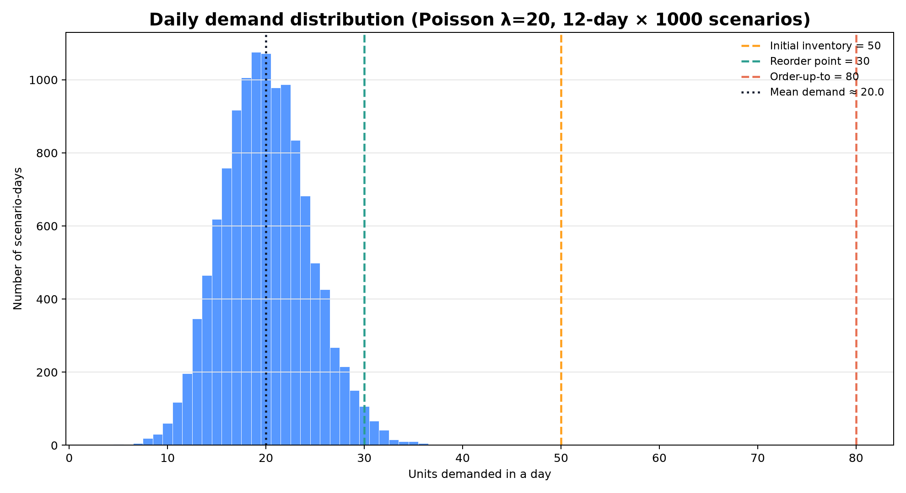
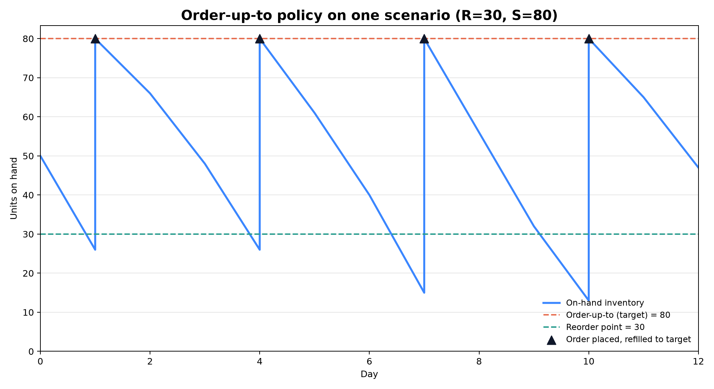
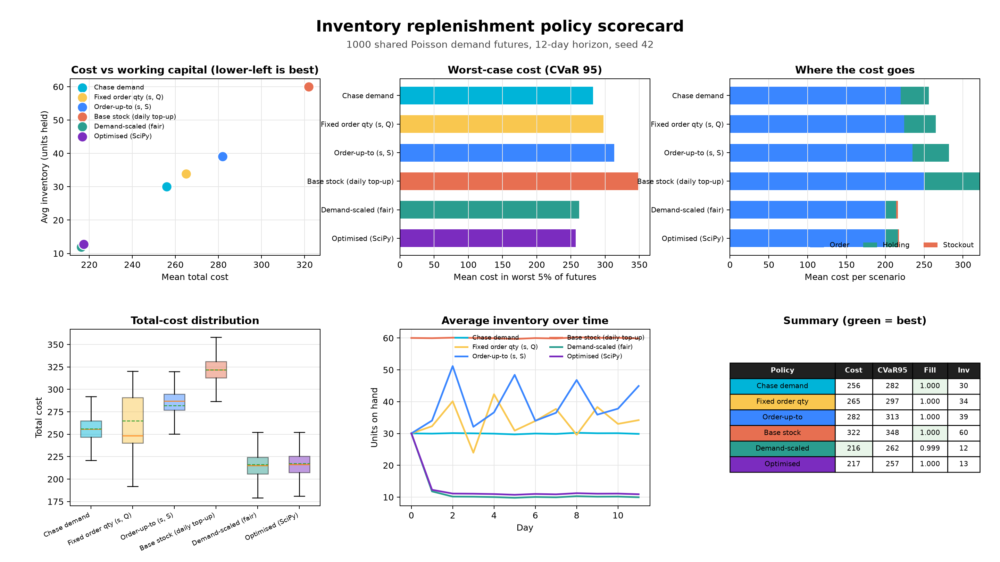
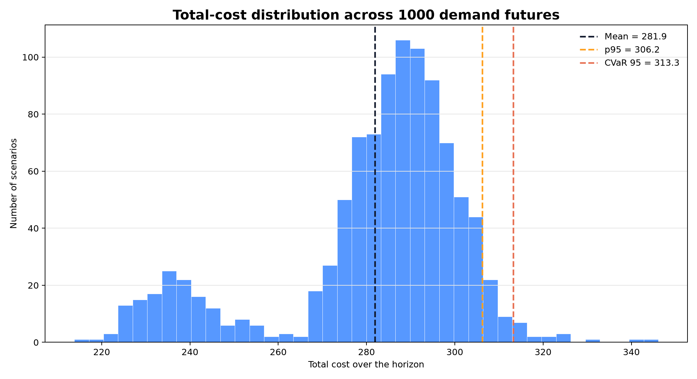
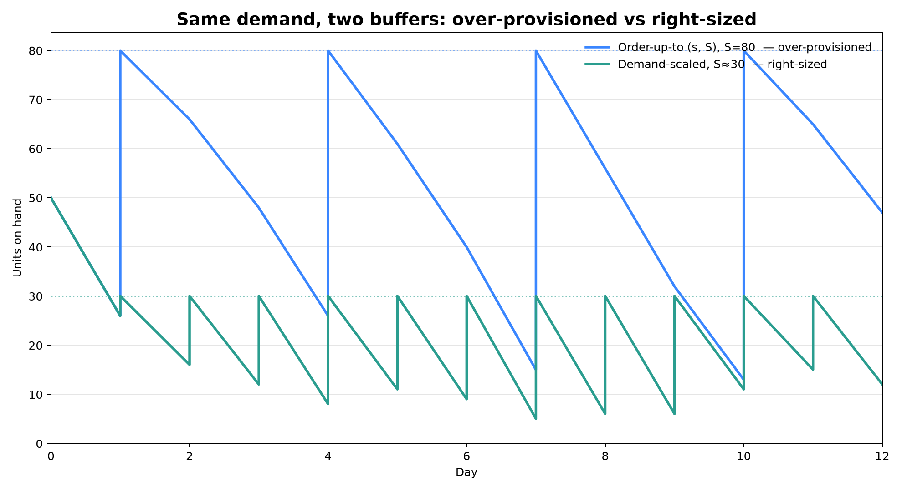
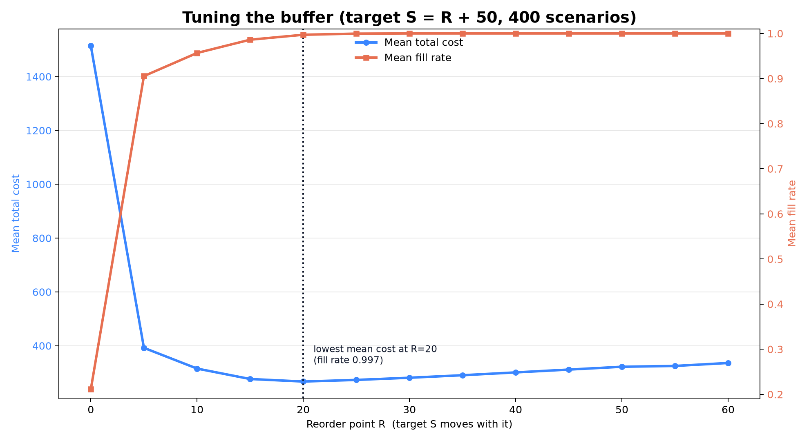
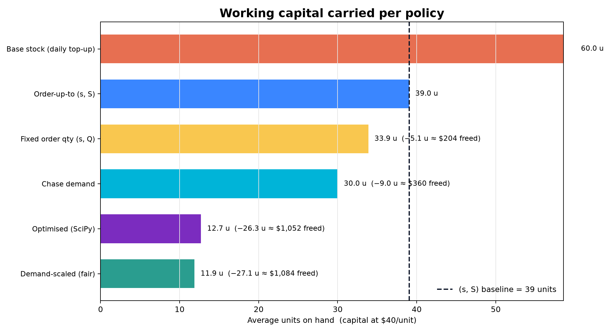

Inventory Example Walkthrough
=============================

This walkthrough builds a **decision tool for a single stocking location**. It
answers a question every inventory owner faces -- *which replenishment policy
should we run, and how large a buffer is worth holding?* -- by evaluating each
candidate against many simulated demand futures rather than a single point
forecast.

The setting is deliberately small: one item, one location, reviewed once per
day. That keeps every component -- data, policy, model, metrics -- easy to
inspect, while the mechanics are identical to the larger
:doc:`multi_echelon_inventory` and :doc:`logistics` examples. It is the
recommended entry point to the framework.

On each simulated day the model:

* asks the policy how much to order, using only the stock currently on hand;
* meets that day's demand from available stock;
* discards any demand it cannot meet (a *lost-sales* model, not backorders);
* charges ordering, holding, and stockout costs, and records per-period metrics.

The code lives in ``examples/inventory`` and is not part of the installed
``sda`` package API.

.. admonition:: The bottom line

   Replacing a hand-tuned order-up-to policy with one sized to demand and cost
   structure (the *demand-scaled* / *optimized* rules) delivers, **at unchanged
   service (≈100% fill):**

   * **≈69% less average inventory** -- working capital released, ≈ ``$1,080``
     per item-location at $40/unit (≈ ``$270``/year in carrying cost);
   * **≈23% lower expected total cost;**
   * **≈18% lower worst-case (CVaR-95) cost,** with a tighter, more predictable
     cost distribution.

   The winner is a two-number rule that needs no manual tuning, so it deploys and
   audits trivially and scales across the whole catalog. The rest of this page is
   the evidence behind those numbers.

1. The Business Problem
-----------------------

Every stocking decision trades off three costs that pull in opposite directions:

* **Ordering** -- a per-unit cost of moving stock, so replenishing constantly is
  wasteful.
* **Holding** -- a per-unit, per-day carrying cost. It is working capital
  immobilized on a shelf, plus storage, insurance, and obsolescence.
* **Stockouts** -- the expensive failure mode. In a lost-sales setting unmet
  demand is gone for good, and the penalty per lost unit is far higher than the
  cost of holding one.

No single buffer minimizes all three at once. Hold too little and you save
carrying cost but lose sales; hold too much and you protect service but freeze
cash. The objective is therefore neither "never stock out" nor "hold as little
as possible" -- it is to minimize *expected total cost* while keeping the *tail*
(cost under adverse demand) bounded. That is a policy-selection problem, and the
rest of this page solves it with evidence: candidate policies compared on cost,
service, working capital, and downside risk over a common set of demand
scenarios.

2. The Daily Decision
---------------------

``examples/inventory/models.py`` implements the location as a single SimPy
process that repeats four steps for each day of the horizon:

.. code-block:: python

   for demand in demand_path:
       order = float(self.policy.act(state, env, recorder.history))
       available = state.inventory + order
       sales = min(available, float(demand))
       lost_sales = max(float(demand) - available, 0.0)
       state.inventory = available - sales
       cost = (
           self.order_cost * order
           + self.holding_cost * state.inventory
           + self.stockout_cost * lost_sales
       )

The sequencing is deliberate and matters for correctness: the policy commits to
an order *before* the day's demand is observed -- it acts on the information
available at decision time, not on hindsight. Demand that exceeds available
stock is lost, never carried forward. Each day the process records the realized
cost and the operational metrics, then advances the clock with
``yield env.timeout(1.0)``.

3. Modeling Demand Uncertainty
------------------------------

``InventoryDataModule`` (``examples/inventory/data.py``) holds the scenario
configuration and yields ``ScenarioBatch`` objects. Each scenario is one
independent future -- a full demand path plus an initial on-hand position:

.. code-block:: python

   data = InventoryDataModule(
       horizon=12,
       n_scenarios=1000,
       batch_size=128,
       initial_inventory=50,
       demand_lambda=20,
       seed=42,
   )

This generates 1000 independent 12-day futures. Daily demand is Poisson with
mean ``demand_lambda=20`` (standard deviation ≈ √20 ≈ 4.5 units). The
coefficient of variation is modest, but the right tail still produces occasional
spikes -- and those spikes are where a thin buffer is punished.

The demand mass sits well to the left of both the ``order_up_to=80`` target and
the ``reorder_point=30`` trigger -- an early signal that the hand-set order-up-to
policy carries more buffer than a 20-unit/day mean requires.

Internally the module delegates to ``GeneratorDataModule``, supplying a
``demand_generator`` closure and ``initial_inventory`` as the shared initial
state. Fixing ``seed`` gives every policy the *same* set of futures -- common
random numbers, the standard variance-reduction technique that turns a noisy
comparison into a paired one and lets small, real differences show through.

4. The Order-Up-To Policy
-------------------------

Each scenario is driven by a decision rule in
``examples/inventory/policies.py``. In the sequential-decision-analytics
vocabulary this is a *policy function approximation* (PFA): a transparent
function from the observed state to today's action. Here the state is on-hand
inventory and the action is the order quantity.

.. code-block:: python

   class OrderUpToPolicy(Policy):
       def act(self, state, env, history):
           if state.inventory < self.reorder_point:
               return max(self.order_up_to - state.inventory, 0.0)
           return 0.0

It exposes two parameters a planner can reason about directly:

* **Reorder point** (``reorder_point``, the *s* in *(s, S)*): do not order while
  on-hand stock is at or above this level.
* **Order-up-to level** (``order_up_to``, the *S*): once stock falls below the
  reorder point, order enough to return to this target.

The example instantiates it as ``OrderUpToPolicy(reorder_point=30,
order_up_to=80)``. Those two numbers are the entire control: raise them to buy
more protection (and carry more stock), lower them to release capital at the
risk of lost sales.

A single scenario makes the rule concrete. On-hand stock declines as demand is
served (the sloping segments); whenever a day opens below the reorder point, the
policy places an order that lifts stock straight to the target of 80 (the
vertical steps, marked at the target line). This is the classic inventory
sawtooth: the reorder point is the floor that triggers replenishment, and the
order-up-to level is the ceiling each order restores.

5. Running an Evaluation
------------------------

``examples/inventory/main.py`` assembles the three pieces -- data, policy, model
-- and passes them to ``evaluate``:

.. code-block:: python

   from sda import evaluate

   model = InventoryModel(
       policy=OrderUpToPolicy(reorder_point=30, order_up_to=80),
       order_cost=1.0,
       holding_cost=0.1,
       stockout_cost=8.0,
   )
   result = evaluate(model, data)

The cost weights encode the business's priorities: a lost unit
(``stockout_cost=8.0``) is 80× as expensive as holding a unit overnight
(``holding_cost=0.1``). That ratio is precisely why a well-tuned policy leans
toward holding a buffer -- and, as section 6 shows, exactly how large a buffer.

Run it from the repository root:

.. code-block:: bash

   uv run -m examples.inventory

or, equivalently:

.. code-block:: bash

   uv run -m examples.inventory.main

If the package requirements are already installed, the direct form also works:

.. code-block:: bash

   python3 -m examples.inventory

6. A Ladder of Policies
-----------------------

Order-up-to is one rule among many, and not self-evidently the best.
``examples/inventory/policies.py`` provides a *ladder* of policies, each rung
introducing one additional idea, so the comparison isolates how much each idea
is worth in cost and capital:

``ChaseDemandPolicy`` (``chase_demand``)
   Orders exactly the previous day's realized demand, reconstructed from the
   scenario history. *The lever:* reactive replenishment with no deliberate
   safety buffer -- the intuitive "replace what sold" heuristic.

``FixedOrderQuantityPolicy`` (``reorder_fixed_qty``)
   The *(s, Q)* rule: below the reorder point, order a fixed lot ``Q``.
   *The lever:* a fixed order quantity -- the behavior most ERP reorder points
   and supplier minimum-order-quantity agreements actually impose.

``OrderUpToPolicy`` (``reorder_up_to``)
   The *(s, S)* rule from section 4, with hand-set levels ``R=30``, ``S=80``.
   *The lever:* replenish to a target, using judgement rather than a fitted
   value.

``BaseStockPolicy`` (``base_stock``)
   Restores a fixed level every day. *The lever:* maximal safety -- the "carry
   more to be safe" instinct, included as the over-provisioned end of the ladder
   against which the others are measured.

``DemandScaledOrderUpToPolicy`` (``demand_scaled``)
   The fair, defensible baseline. Rather than judgement, the level is derived
   from the demand distribution and the newsvendor **critical ratio** implied by
   the costs, ``Cu / (Cu + Co) = 8 / 8.1 ≈ 0.988``. *The lever:* size the buffer
   to the objective. Concretely, base-stock ≈ ``μ + z·σ`` with
   ``z = Φ⁻¹(0.988) ≈ 2.24``, giving ``S ≈ 30`` for ``μ=20``, ``σ≈4.5``.

``OptimizedBaseStockPolicy`` (``optimized_base_stock``)
   Minimizes expected daily cost over the base-stock level numerically, using
   ``scipy.optimize`` over the exact Poisson demand distribution. *The lever:*
   let a solver find the level. Absent SciPy it falls back to the closed-form
   newsvendor quantile; the numerical optimum (``S=31``) and the
   normal-approximation level (``S≈30``) agree to within a unit -- a useful
   cross-check.

``examples/inventory/policy_comparison.py`` evaluates every rung against the
*same* seeded futures (common random numbers, so differences are not sampling
noise) and renders a scorecard:

.. code-block:: bash

   uv run --with scipy -m examples.inventory.policy_comparison --no-plot
   uv run --with scipy --with matplotlib -m examples.inventory.policy_comparison

The six panels connect *what a policy does* to *what it costs*: mean cost versus
working capital (lower-left is best), worst-case tail cost, the
ordering/holding/stockout split, the full cost distribution, the average
inventory each rule holds over time, and a summary table with the best cost and
service highlighted.

7. Reading the Results
----------------------

The comparison prints one row per policy:

.. code-block:: text

   Inventory policy comparison (12-day horizon, 1000 scenarios, seed 42)
   policy                     cost_mean       cost_ci95  cost_cvar95   fill  stockout  inv_mean  order/day
   -------------------------  ---------  --------------  -----------  -----  --------  --------  ---------
   Chase demand                   255.9  (255.1, 256.7)        282.2  1.000     0.000      30.0       18.3
   Fixed order qty (s, Q)         264.9  (263.4, 266.5)        297.4  1.000     0.001      33.9       18.7
   Order-up-to (s, S)             281.9  (280.6, 283.2)        313.3  1.000     0.000      39.0       19.6
   Base stock (daily top-up)      321.9  (321.1, 322.7)        348.2  1.000     0.000      60.0       20.8
   Demand-scaled (fair)           216.3  (215.3, 217.4)        262.3  0.999     0.011      11.9       16.6
   Optimised (SciPy)              217.4  (216.4, 218.3)        256.9  1.000     0.011      12.7       16.7

Column definitions:

``cost_mean`` (lower is better)
   Mean total cost over the 1000 futures.

``cost_ci95``
   95% confidence interval for the mean. Overlapping intervals indicate a
   ranking sampling cannot resolve -- here ``demand_scaled`` and
   ``optimized_base_stock`` overlap and are statistically tied.

``cost_cvar95`` (lower is better)
   Conditional Value-at-Risk at 95% -- the mean cost across the worst 5% of
   futures (expected shortfall). This is the downside-risk measure.

``fill`` (higher is better)
   Fill rate: the fraction of demand met immediately from stock.

``stockout`` (lower is better)
   The share of periods with any unmet demand -- one minus the cycle service
   level.

``inv_mean``
   Average on-hand units. This is working capital, not a score to maximize.

Four dimensions decide the choice.

**Service.** Every policy that orders holds fill at ≈100% with negligible
stockouts, so service is not the differentiator -- any deliberate buffer secures
it. The contest is therefore about the *cost* of that service.

**Working capital.** Here the policies separate sharply. The hand-set
``base_stock`` and *(s, S)* rules average 39-60 units on hand; the demand-scaled
and optimized rules hold ≈12 -- about **69% less inventory for the same
service.** Because ``inv_mean`` is immobilized cash, this is the headline result.

**Tail risk and variability.** Averages conceal risk, so we also report
``cost_cvar95``. The optimized policy is not only cheaper on average (217 vs 282)
but ≈18% cheaper in the tail (257 vs 313), with a visibly tighter cost
distribution (the scorecard's boxplot panel). It dominates on all three: mean,
tail, and dispersion.

**The deliberate trade-off.** The demand-scaled and optimized rules concede a
negligible amount of service -- a 0.1% drop in fill, unmet demand in ≈1.1% of
periods -- for that large reduction in capital. Given the 80:1
stockout-to-holding cost ratio, the trade is strongly favorable; it is exactly
the balance the critical ratio is constructed to strike.

A methodological note that recurs across these examples: **compare
distributions, not point estimates.** Evaluate each policy on its full cost
distribution -- mean, confidence interval, and CVaR together -- over common
random scenarios, as the scorecard's boxplot does.

A closer look at the base policy
~~~~~~~~~~~~~~~~~~~~~~~~~~~~~~~~~~

Isolating the default order-up-to policy, the single-policy run
(``uv run -m examples.inventory``) reports:

.. code-block:: text

   Total cost mean: 281.89
   Total cost p95: 306.20
   Total cost CVaR 95: 313.27
   Inventory t=5 mean: 48.44
   Fill rate mean: 1.000
   Stockout rate: 0.000

Here ``Total cost mean`` is the average across the 1000 futures; ``p95`` and
``CVaR 95`` are the 95th percentile and the worst-5% mean, both only ~10% above
the mean, so the policy is stable rather than merely cheap on average; and the
fill and stockout rates of 1.000 and 0.000 show it never stocks out over the
simulated horizon.

The cost distribution confirms it: mean, p95, and CVaR-95 cluster tightly,
marking a policy that is both economical and low-variance.

Perfect service, however, is a symptom of over-provisioning. An average
mid-horizon inventory of 48 units against 20-unit/day demand means the shelf is
rarely near empty; the stockout penalty almost never fires, so most of the cost
is holding and ordering paid for protection that goes unused. Placing the
right-sized demand-scaled policy beside it on the *same* demand path makes the
waste plain:

Both rules hold service, but the order-up-to policy cycles between roughly 15
and 80 units while the demand-scaled policy cycles near 10-30 -- carrying far
less stock to serve the identical demand. Lowering the reorder point and target
together traces that trade-off across the whole range:

Sweeping the reorder point down (with the target following at a fixed offset)
traces the cost frontier. Cut the buffer too far and fill collapses while
stockout penalties dominate; hold too much and carrying cost grows. Total cost
is **U-shaped**, minimized near ``R=20`` -- so the default ``R=30`` is already
close to optimal, positioned just on the conservative side of the minimum where
fill remains 100%. This is the trade-off the aggregate numbers hinted at, made
explicit.

8. From Inventory to Working Capital
------------------------------------

Freed working capital is the outcome the business ultimately cares about. A team
that hand-tuned the *(s, S)* rule would average ≈39 units on hand; the
demand-scaled and optimized levels hold ≈12 while service is unchanged.
Converting that reduction to money requires two figures for your own product --
its unit cost, and an annual holding-cost rate (commonly 15-30% of unit cost
once capital, storage, insurance, and obsolescence are included):

.. list-table::
   :header-rows: 1

   * - Policy
     - Avg on-hand
     - Capital freed vs (s, S) @ $40/unit
     - Ongoing saving @ 25%/yr
   * - Order-up-to (s, S)
     - ``39.0``
     - baseline
     - baseline
   * - Demand-scaled (fair)
     - ``11.9``
     - ``$1,084``
     - ``$271`` / year
   * - Optimised (SciPy)
     - ``12.7``
     - ``$1,052``
     - ``$263`` / year

The dollar figures are illustrative, for one product on one shelf -- substitute
your own unit cost and rate. What is assumption-free, and therefore
transferable, are the percentages: **≈69% less average inventory, ≈23% lower
total cost, and ≈18% lower worst-case cost.** In practice the same rule runs
across an entire catalog and network, so the absolute saving scales with the
number of items that share it.

9. Choosing a Policy
--------------------

The scorecard is built to answer one question -- *which policy should we
deploy?* -- through whichever lens governs the decision:

* **Capital-constrained:** read ``inv_mean`` and the freed-capital table;
  ``demand_scaled`` and ``optimized`` release the most working capital.
* **Contractual service level:** read ``fill`` and ``stockout``; every ordering
  policy clears ≈100%, so choose the cheapest that meets the committed floor.
* **Risk-averse to bad periods:** read ``cost_cvar95`` and the boxplot; prefer
  the lowest, tightest tail over the lowest mean.

Recommended workflow: **begin from the demand-scaled level** -- it requires no
tuning, only demand statistics and the cost ratio -- validate it on the
scorecard, and inspect the CVaR tail before committing. Escalate to a hand-tuned
*(s, S)* or a heavier optimizer only when a constraint the simple rule ignores
(a supplier minimum order quantity, a shelf-space cap, a positive lead time)
makes it necessary. In every case the decision is made against 1000 replayed
futures rather than a single forecast, so it is defensible before a unit is
ordered.

10. Metrics Reference
---------------------

The model records inventory-specific metrics through the recorder (enumerated in
``examples/inventory/metrics.py``): ``inventory``, ``stockout``, ``fill_rate``,
``order_quantity``, ``lost_sales``, and ``sales``. The framework appends the
trajectory-level ``total_cost`` when the recorder closes.

For risk-sensitive comparisons, work with the total-cost distribution:

.. code-block:: python

   result["total_cost"].mean()
   result["total_cost"].percentile(95)
   result["total_cost"].cvar(0.95)

For point-in-time or full-trajectory views, use the per-period metrics:

.. code-block:: python

   result["inventory"].at_time(5).mean()
   result["fill_rate"].mean()
   result["stockout"].mean()

As a rule of thumb: ``mean`` for average performance, percentiles for
distribution shape, and ``cvar(0.95)`` for expected cost in the adverse tail.

Why This Matters for Inventory Planning
---------------------------------------

Inventory replenishment is the archetypal problem this approach targets: the
decision recurs daily, today's order determines tomorrow's opening stock, and
demand is genuinely stochastic rather than a number a single forecast can pin
down. A point forecast hides that risk; replaying many plausible futures
surfaces it. And because the policies under comparison stay simple and legible, a
planning team can audit and trust the winner -- and defend it with freed capital,
service level, and worst-case cost all quantified before touching the live
system. The same procedure extends directly to a full catalog, each item
carrying its own demand-scaled level.

Extending the Model
-------------------

The example is intentionally minimal so the mechanics stay legible, yet it is a
faithful slice of the loop the larger examples use. Natural extensions:

* **Jointly optimize both levers.** The sweep above varies the reorder point at
  a fixed offset; a full 2-D grid over ``reorder_point`` *and* ``order_up_to``
  maps the efficient frontier -- the manual counterpart to the optimizer in
  :doc:`multi_echelon_inventory`.
* **Allow backorders.** Unmet demand is currently lost; carrying it forward as
  backlog changes which buffer is optimal.
* **Introduce lead time.** Replenishment is instantaneous here. A positive -- and
  uncertain -- lead time is what makes the reorder point a genuinely hard
  parameter, and is the next step the multi-echelon example takes.

The figures on this page are regenerated from live evaluations, so they never
drift from the code:

.. code-block:: bash

   uv run --with matplotlib -m examples.inventory.visualize
   uv run --with scipy --with matplotlib -m examples.inventory.policy_comparison
