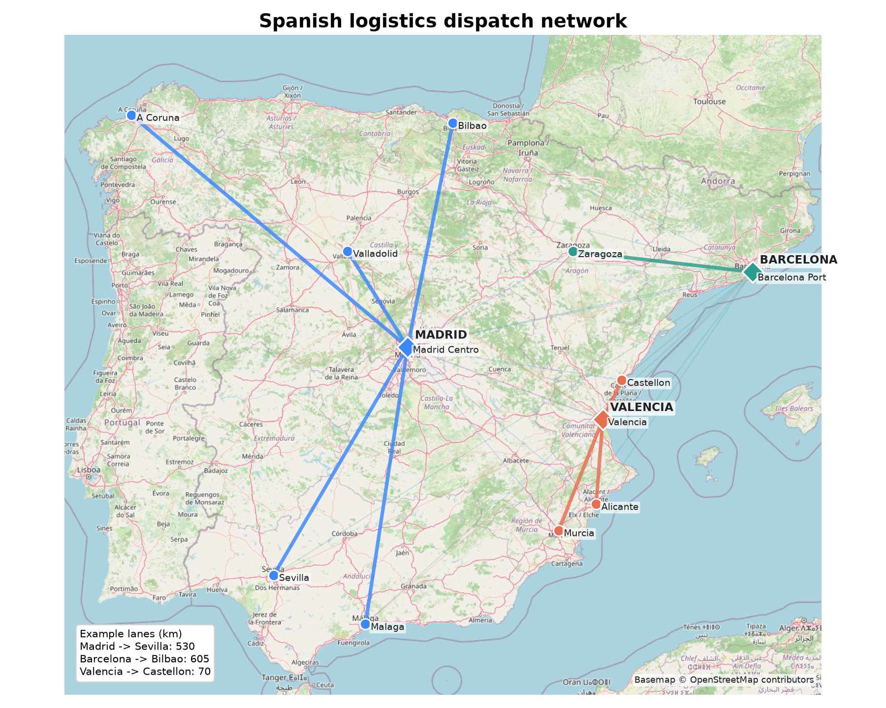
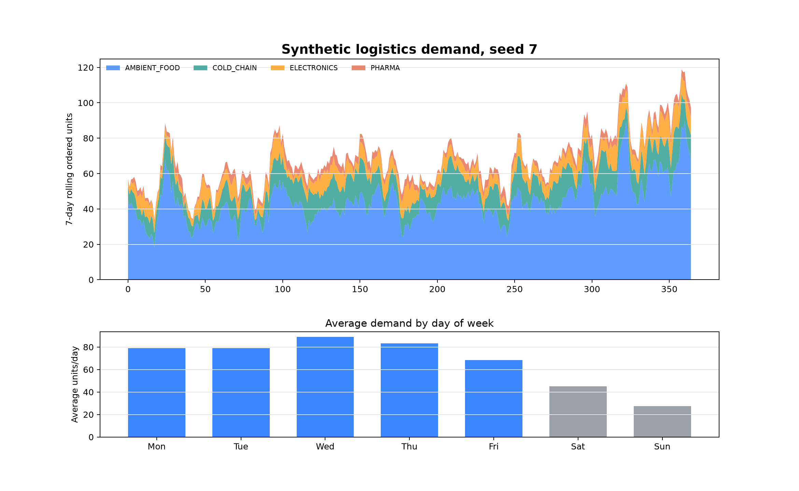
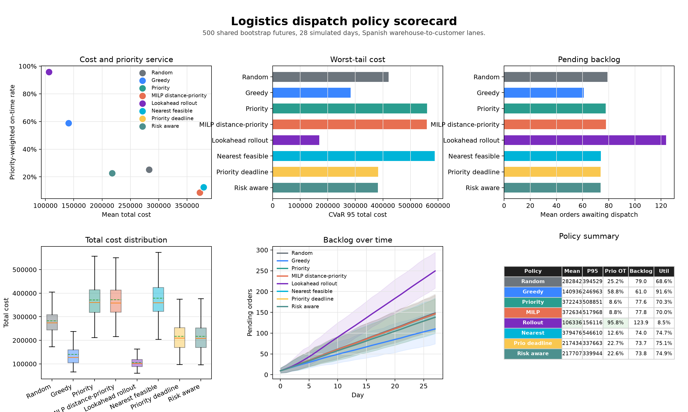
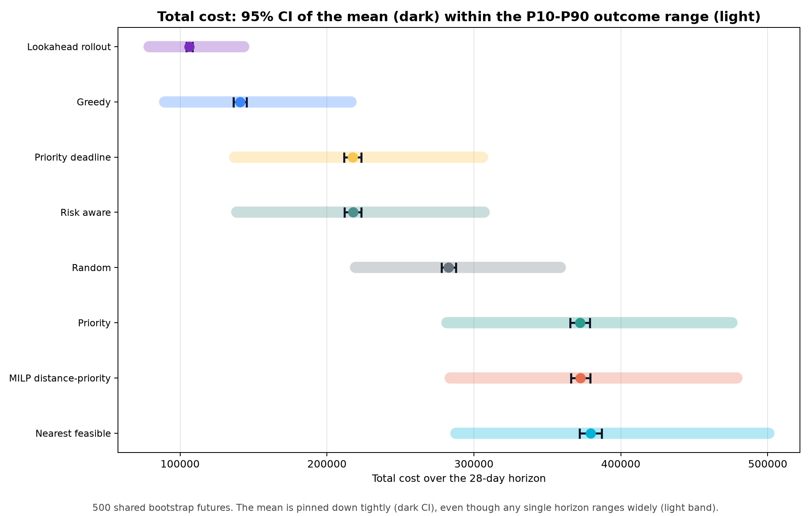
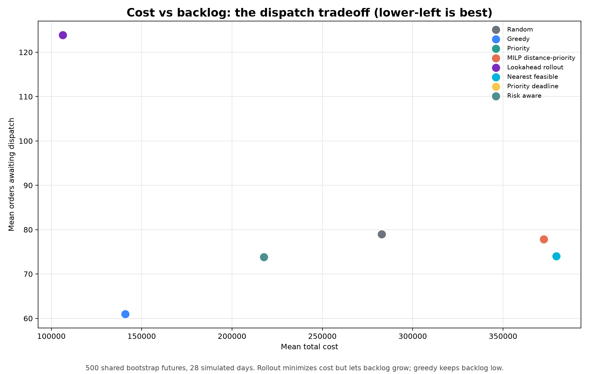
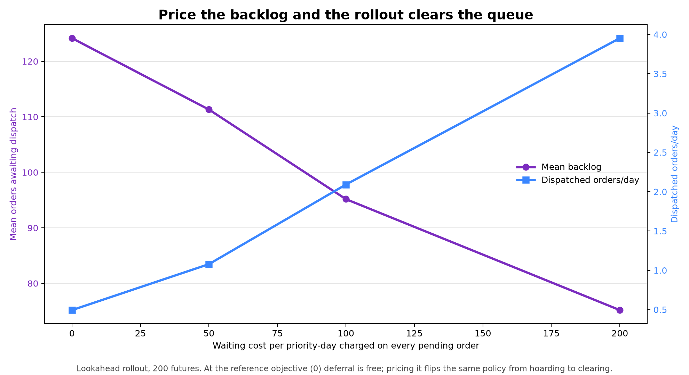

Logistics Dispatch Walkthrough
==============================

This walkthrough sets up a road-freight dispatch problem across Spain. A
distribution company operates warehouses in Madrid, Barcelona, and Valencia and
serves twelve customer locations with six heterogeneous vehicles. Each day it
must decide **which pending orders to dispatch, from which warehouse, on which
vehicle** -- under uncertain demand, traffic, and vehicle availability.

Where the :doc:`inventory` and :doc:`multi_echelon_inventory` examples tune a
*replenishment* policy, this one compares *dispatch* policies. The shared idea is
the same: evaluate each candidate rule against many simulated futures and judge
it on cost, service, and downside risk rather than a single run.

Each simulated day, the model:

* dispatches feasible pending orders from the current state,
* reveals new orders, traffic delays, event labels, and vehicle outages,
* updates inventory, vehicles, backlog, deliveries, and costs,
* records service, backlog, utilization, and tail-risk metrics.

The example lives in ``examples/logistics`` and is not part of the installed
``sda`` package API.

.. admonition:: The bottom line

   Across 500 bootstrapped 28-day futures, the best policy is **conditional on
   the objective**. The **lookahead rollout** more than halves expected cost
   versus the naive baseline (≈``106k`` vs ``283k``), with the lowest tail cost
   and the best priority-weighted on-time service (95.8%) -- but it wins by
   dispatching *selectively*, so backlog grows to the highest of any policy. If
   clearing backlog and using the fleet are hard requirements, **greedy** is the
   strongest simple rule. The
   takeaway: judge policies on the whole cost distribution *and* the operational
   metrics together, never on one average.

1. The Business Goal
--------------------

From a business standpoint, the dispatcher is not trying to move the most orders
or minimize today's kilometers. The goal is to protect customer service and
margin under uncertain demand, traffic, and vehicle availability. A good dispatch
policy should:

* deliver high-priority orders on time,
* avoid letting backlog grow into an unserviceable queue,
* control distance, handling, late-delivery, and bad-week tail costs,
* use fleet capacity sensibly without dispatching low-value work just to keep
  trucks busy,
* remain robust across many plausible futures, not only one average day.

These goals trade off against each other. A policy that dispatches every easy
order can still fail if urgent orders miss their deadlines; a policy that keeps
late cost low by dispatching almost nothing can fail if backlog growth is
unacceptable. The comparison therefore reads every policy through both cost and
operational metrics.

2. The Cost Objective
---------------------

The simulator ranks policies by expected total cost over sampled demand and
disruption scenarios. Each day's cost has four components:

``dispatch cost``
   Distance cost plus per-unit handling cost for orders dispatched that day.

``late cost``
   A penalty for delivered orders that miss their deadline, scaling with late
   days, order quantity, and priority.

``overdue backlog cost``
   A smaller daily penalty for pending orders already past deadline. In the
   default model this is ``2.0 * priority`` per overdue order-day.

``invalid assignment cost``
   A penalty for infeasible assignments, such as using an unavailable vehicle or
   drawing more inventory than a warehouse holds.

This objective rewards low cost and on-time high-priority delivery. It does
**not** hard-code a minimum dispatch volume, a minimum utilization, or a maximum
backlog. Those operational requirements are tracked as *metrics*, not
constraints -- which matters when reading the results: a policy can look
excellent on total cost while still letting backlog grow unchecked.

3. Run the Default Policy
-------------------------

Start with the default priority policy:

.. code-block:: bash

   uv run -m examples.logistics

If your environment already has the package requirements installed:

.. code-block:: bash

   python3 -m examples.logistics

The command prints distribution summaries for total cost, worst-tail cost,
on-time service, priority-weighted service, late cost, backlog, dispatch volume,
and vehicle utilization.

4. The Network
--------------

The network uses a 3 x 12 warehouse-to-customer distance matrix over an
OpenStreetMap basemap. Heavy lanes show each customer's nearest warehouse; faint
lanes show alternate feasible origins.

5. Synthetic Demand
-------------------

``synthetic_history(days, seed)`` creates a deterministic history of orders,
traffic multipliers, vehicle outages, and event labels. The seed controls the
entire history, so demand, traffic, and outages are fully reproducible.

The synthetic demand captures:

* weekday and weekend demand rhythm,
* annual seasonality with a year-end peak,
* promotions and holiday peaks that lift order volume,
* severe weather and port congestion that increase travel time and outages,
* an SKU mix across ``AMBIENT_FOOD``, ``COLD_CHAIN``, ``ELECTRONICS``, and
  ``PHARMA``.

6. Bootstrap Scenarios
----------------------

``LogisticsDataModule`` samples contiguous 7-day blocks from the synthetic
history. Each batch contains:

* ``orders`` with shape ``[batch_size, horizon]`` as tuples of ``Order`` records,
* ``traffic_multiplier`` with shape ``[batch_size, horizon, warehouse, customer]``,
* ``vehicle_outages`` with shape ``[batch_size, horizon, vehicle]``,
* ``event_labels`` and ``history_day_index`` for inspection and repeatability.

The simulator calls ``decide`` before each day's exogenous information is
revealed, so new same-day orders are appended to ``pending_orders`` for the next
day's dispatch decision -- the policy never sees the future it is about to face.

.. code-block:: python

   data = LogisticsDataModule(
       horizon=28,
       n_scenarios=500,
       batch_size=64,
       seed=42,
   )

Fixing ``seed`` gives every policy the same set of futures -- common random
numbers, so the comparison is paired rather than noisy.

7. The Dispatch Policies
------------------------

The example includes eight dispatch policies, spanning naive baselines to a
lookahead rollout:

``RandomPolicy``
   Randomly shuffles feasible assignments and greedily keeps a conflict-free
   set. The baseline.

``GreedyPolicy``
   Sorts feasible assignments by shortest warehouse-to-customer lane, then
   greedily keeps a conflict-free set.

``PriorityPolicy``
   Scores priority, quantity, deadline pressure, rescue pressure, duration, and
   lane distance before greedily selecting compatible assignments.

``MilpPolicy``
   Solves the same priority-distance objective globally with one-order,
   one-vehicle, and warehouse-SKU inventory constraints when SciPy is available.
   Falls back to ``PriorityPolicy`` if no MILP solution is found.

``LookaheadRolloutPolicy``
   Compares priority, greedy, and defer-first decisions by rolling out sampled
   futures with ``PriorityPolicy`` as the continuation policy. Degrades to
   ``PriorityPolicy`` if no rollout model is bound.

``NearestFeasiblePolicy``
   Dispatches pending orders FIFO from the nearest warehouse with enough stock
   and an available vehicle.

``PriorityDeadlinePolicy``
   Dispatches high-priority and tight-deadline orders first, then chooses the
   nearest feasible warehouse and vehicle.

``RiskAwareDispatchPolicy``
   Scores priority, deadline slack, lane distance, stock scarcity, and vehicle
   fit before choosing assignments.

8. Interpreting Results
-----------------------

Running the comparison produces a scorecard figure and a text table over the
same bootstrapped futures:

.. code-block:: bash

   uv run -m examples.logistics.policy_comparison --horizon 28 --n-scenarios 500 --batch-size 64 --seed 42

The ``--no-plot`` flag prints the numbers alone:

.. code-block:: text

   Logistics policy comparison (28-day horizon, 500 scenarios, seed 42)
   policy                  total_mean        total_ci95  cost_cvar95  prio_ot  late_cost  backlog  dispatch/day   util
   ----------------------  ----------  ----------------  -----------  -------  ---------  -------  ------------  -----
   Random                      282842  (278051, 287633)       420946    25.2%     7405.9     79.0           4.1  68.6%
   Greedy                      140936  (136459, 145412)       282695    58.8%     3228.1     61.0           5.5  91.6%
   Priority                    372243  (365599, 378887)       560571     8.6%    11450.0     77.6           4.2  70.3%
   MILP distance-priority      372634  (366054, 379214)       559201     8.8%    11459.5     77.8           4.2  70.0%
   Lookahead rollout           106336  (104172, 108500)       169106    95.8%      117.0    123.9           0.5   8.5%
   Nearest feasible            379476  (372056, 386896)       588208    12.6%    11608.4     74.0           4.5  74.7%
   Priority deadline           217434  (211623, 223245)       383052    22.7%     5925.5     73.7           4.5  75.1%
   Risk aware                  217707  (211935, 223480)       381989    22.6%     5929.9     73.8           4.5  74.9%

How to read the columns:

``total_mean`` (lower is better)
   Average total cost over all bootstrap futures.

``total_ci95``
   Approximate 95% confidence interval for mean total cost. Heavily overlapping
   intervals mean a ranking is not robust.

``cost_cvar95`` (lower is better)
   Conditional Value-at-Risk for total cost -- the average cost in the worst 5%
   of scenarios (expected shortfall). The downside-risk number.

``prio_ot`` (higher is better)
   Priority-weighted on-time service. This matters more than raw delivery count,
   because missing high-priority orders is expensive.

``late_cost`` (lower is better)
   Average late-delivery penalty per scenario-day.

``backlog`` (lower is better)
   Average number of orders waiting for dispatch.

``dispatch/day``
   Average dispatched orders per day -- throughput, not value. Moving more orders
   is not automatically better if they are the wrong orders.

``util``
   Average fraction of vehicles dispatched each day.

Ranking the policies by cost shows two kinds of uncertainty at once: a light
**P10-P90 band** for how much a single 28-day horizon might cost, and the tight
dark **95% CI of the mean** inside it. Five hundred futures pin the *means* down
precisely (the CIs barely separate from the dots), yet the outcome *bands*
overlap heavily -- so in any given month a higher-mean policy can still come out
cheaper than a lower-mean one:

What the table shows:

* **Best objective value: the lookahead rollout.** Lowest mean cost (106,336),
  lowest tail cost (CVaR 169,106), lowest late cost (117), and best
  priority-weighted on-time service (95.8%). Under the current cost model, it is
  the winning policy.
* **But it wins by being selective.** It dispatches only 0.5 orders/day and uses
  8.5% of the fleet, while backlog rises to 123.9 orders. Excellent for the cost
  objective, but potentially unacceptable if clearing backlog or using capacity
  is a hard business requirement -- exactly the metric-vs-constraint distinction
  from section 2.
* **Best simple high-throughput rule: greedy.** It dispatches the most orders
  (5.5/day), uses the fleet heavily (91.6%), and is the best non-rollout policy
  on mean cost -- though still well behind rollout on late cost, tail risk, and
  priority service.
* **Middle tier: priority-deadline and risk-aware.** Nearly tied; risk-aware has
  slightly better tail cost, priority-deadline slightly better mean cost. Both
  beat random but trail greedy and rollout.
* **Avoid nearest-feasible for this objective.** FIFO nearest-feasible dispatch
  is worst on mean and tail cost because it ignores which orders are expensive to
  miss.
* **Priority and MILP need recalibration.** They are statistically tied (their
  confidence intervals overlap almost completely) because the MILP optimizes the
  same one-day score as ``PriorityPolicy``; in this scenario that score is
  misaligned with realized cost, so global optimization does not help.

Plotting mean cost against mean backlog turns the central tension into one
picture:

The rollout sits top-left -- cheapest, but with the highest backlog -- while
greedy sits bottom-left, nearly as cheap with far less backlog. The reason is
structural: the cost model charges to *dispatch* an order (distance, handling,
late-delivery risk) but barely penalizes leaving one in the queue (only a small
``overdue backlog cost`` once past deadline). The rollout, optimizing that exact
objective, discovers it is cheaper to defer all but the urgent, high-priority
orders -- so it earns the best cost and priority service while backlog grows
unbounded. This is not a bug in the optimizer but a gap in the *objective*:
backlog is a tracked metric, not a priced constraint (section 2).

The business decision is therefore conditional. If the objective is exactly the
simulated cost function, choose the lookahead rollout. If the operation must also
clear backlog or keep trucks utilized, do not deploy it unchanged -- give backlog
a realistic price or add a minimum-dispatch or maximum-backlog constraint and
rerun; the rollout will then clear the queue because deferring finally costs what
it costs in reality. If a cheap rule is needed today, greedy is the strongest
simple option, with priority-deadline and risk-aware as safer deadline-aware
candidates after tuning.

Pricing the Backlog
~~~~~~~~~~~~~~~~~~~

That claim is easy to test. The model exposes ``waiting_cost_per_priority_day``
-- a per-day charge on *every* pending order, not only overdue ones. Raising it
from the reference ``0`` re-runs the *same* lookahead rollout against a
properly-priced objective:

.. code-block:: bash

   uv run --with scipy --with matplotlib -m examples.logistics.policy_comparison --backlog-pricing

The behavior flips cleanly. As deferral stops being free, mean backlog falls from
~124 to ~75 orders and dispatch climbs from 0.5 to ~4 orders/day -- same policy,
same fleet, only the objective changed. This confirms the hoarding was a gap in
the cost model, not a defect in the optimizer.

It also exposes a **sweet spot**: pushing the waiting price too high swings the
rollout to the opposite failure -- it dispatches nearly everything and
priority-weighted on-time service falls from 96% to 64%, because limited fleet
capacity gets spent on low-priority orders. The right price sits where backlog is
acceptable *and* high-priority service is protected. Finding it is exactly the
objective tuning the simulator lets you do safely, before touching the real
operation.

9. Metrics Reference
--------------------

The SimPy model records event-level ``cost`` and trajectory-level ``total_cost``
plus logistics-specific metrics:

* ``on_time_rate``
* ``priority_weighted_on_time_rate``
* ``late_cost``
* ``dispatch_cost``
* ``pending_backlog``
* ``dispatched_order_count``
* ``vehicle_utilization``

Use the total-cost distribution for risk-sensitive comparisons:

.. code-block:: python

   result["total_cost"].mean()
   result["total_cost"].percentile(95)
   result["total_cost"].cvar(0.95)

Use step-level metrics for trajectory views:

.. code-block:: python

   scenario_ids, times, backlog = result["pending_backlog"].to_trajectory_matrix()

As with the other examples, the important comparison is not average cost alone: a
useful dispatch policy keeps high-priority service high, controls backlog growth,
and reduces the worst-case tail of total cost.
