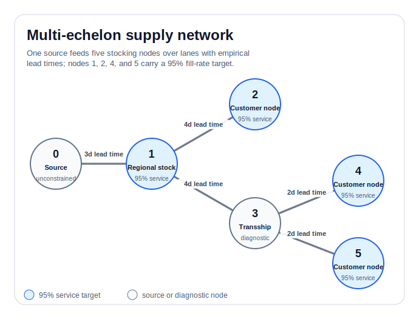
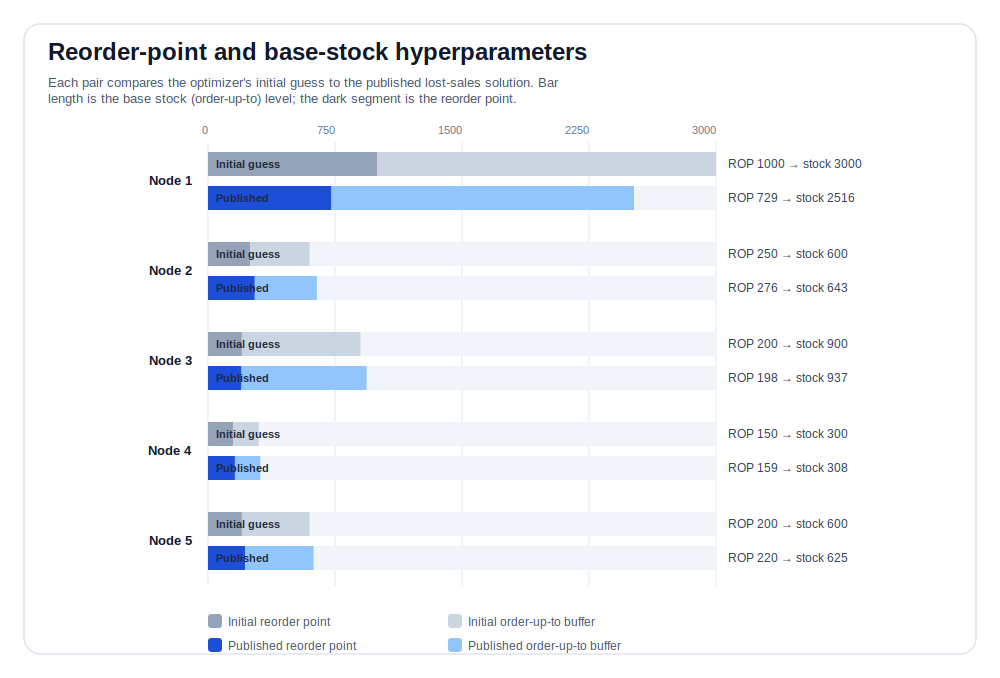
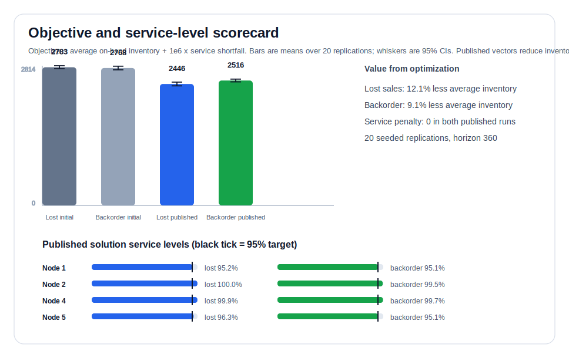
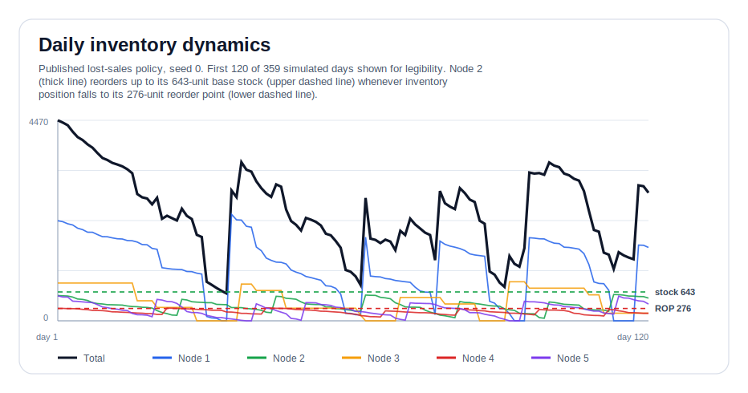

# Multi-Echelon Inventory Optimization

This example reconstructs the simulation-optimization problem from
Agarwal, A. (2019), [Multi-echelon Supply Chain Inventory Planning using
Simulation-Optimization with Data Resampling](https://arxiv.org/abs/1901.00090)
(arXiv:1901.00090), whose reference code is vendored at
`multi-echelon-inventory-optimization/` in this repository, using SimPy for
the discrete-event simulation machinery. The paper's network, base-stock
rule, data-resampling approach, and objective are kept as-is; they are
described and implemented here in SDA's `state` / `policy` / `model` /
`data` / `recorder` terms (see `docs/concepts.rst`), with the reorder points
and base-stock levels framed as a **policy function approximation** whose
hyperparameters a black-box optimizer searches.

The business problem: one source ships a product through a small
distribution network to customer-facing locations. Holding too much
inventory anywhere ties up capital; holding too little causes stockouts at
the nodes customers actually order from. The task is to find, per node, a
reorder point and a base-stock level that meet every service target while
tying up as little inventory as possible.

It keeps the reference problem structure:

- Six-node supply-chain network with node `0` as the unconstrained source.
- Base-stock policy with reorder points (a policy function approximation,
  in the terminology from `docs/concepts.rst`).
- Empirical bootstrap demand and lead-time-delay inputs.
- Lost-sales and backorder service-level accounting modes.
- The reference objective:

  ```text
  average on-hand inventory
  + 1.0e6 * sum(max(0, service target - average service level))
  ```

The original SimPy processes are represented through SDA responsibilities:

- `BaseStockReorderPolicy` owns the replenishment decision rule (the PFA)
  and its ten hyperparameters: a reorder point and base-stock level per
  stocking node.
- `MultiEchelonInventoryModel` owns the SimPy processes, inventory
  transitions, order queues, shipments, and diagnostics -- the emulator that
  turns a hyperparameter vector into simulated on-hand inventory and service
  levels.
- `MultiEchelonInventoryDataModule` owns empirical scenario construction
  (bootstrap resampling of real demand and lead-time-delay history).
- `reference_metrics` lists the emitted reference metric names, and
  `summarize_reference_result` reconstructs the original objective from SDA
  metric records.

## The Network

One source feeds five stocking nodes over lanes with their own empirical
lead times. Nodes 1, 2, 4, and 5 carry a 95% fill-rate target; node 3 is an
intermediate transshipment point with no target of its own.



## The Policy's Hyperparameters

Every stocking node runs the same rule: if inventory position falls to or
below the node's reorder point, order up to its base-stock level. The ten
numbers that define those thresholds per node are exactly what a black-box
optimizer searches over. The chart below compares the optimizer's initial
guess to the published, tuned solution:



Node 1, the regional stocking point with no customer-facing target of its
own, is the most over-provisioned in the initial guess and gives up the most
inventory after tuning. Nodes closer to their service target barely move.

## The Objective

The published SciPy solution vectors from the reference scripts reproduce the
same objective values in SDA:

| Mode | Initial objective | Published objective | Change |
| --- | ---: | ---: | ---: |
| Lost sales | `2783.462` | `2445.776` | `-12.1%` |
| Backorder | `2767.635` | `2515.907` | `-9.1%` |



The scorecard is the main business value of the example: it shows that the
optimized hyperparameter vectors reduce inventory while still clearing every
measured service target, so the service penalty remains zero.

## Watching The Policy Run

Daily diagnostics are opt-in because optimizers usually need only the scalar
objective. When enabled, the trace below shows the network total and node
2's on-hand inventory against its own reorder point and base-stock
hyperparameters, drawn as reference lines, so the connection between the
tuned numbers and the simulated sawtooth is visible directly:



Regenerate these SVGs with:

```bash
python3 -m examples.multi_echelon_inventory.visualize
```

## Why Simulate At All

The SimPy model is a data-driven emulator: it resamples real historical
demand and lead-time-delay observations (not an assumed distribution), runs
the same 20 seeded replications for every candidate hyperparameter vector so
comparisons are apples-to-apples, and reduces any ten-number vector to one
scalar objective through `get_objective(...)` -- exactly the interface a
black-box optimizer (`scipy.optimize`, `skopt.gp_minimize`, `rbfopt`, as used
by the original reference scripts) needs to search the hyperparameter space
without ever touching a live supply chain.

## Standard SDA Flow

The example can be run with the same data, model, evaluate shape as the other
examples:

```python
from examples.multi_echelon_inventory import (
    build_data,
    build_model,
    summarize_reference_result,
)
from sda import evaluate

data = build_data(n_scenarios=20, batch_size=1)
model = build_model()
result = evaluate(model, data)
summary = summarize_reference_result(result)
```

Run the default lost-sales initial-guess evaluation:

```bash
uv run -m examples.multi_echelon_inventory
```

Evaluate the backorder mode:

```bash
uv run -m examples.multi_echelon_inventory --mode backorder
```

Evaluate the published SciPy final solution vector from the reference scripts:

```bash
uv run -m examples.multi_echelon_inventory --published-solution
```

Objective evaluations are fast by default and emit the final objective,
service-level, and average on-hand metrics. Dense per-day diagnostic traces are
available when needed:

```bash
uv run -m examples.multi_echelon_inventory --daily-metrics
```

Programmatically, pass `record_daily_metrics=True` to `build_model`,
`build_result`, `build_evaluation`, `evaluate_reference_policy`, or
`get_objective` to include those daily traces.

To wire this into an external black-box optimizer exactly like the original
`getObj` reference function:

```python
from examples.multi_echelon_inventory import get_objective

value = get_objective([2000, 350, 700, 150, 400, 1000, 250, 200, 150, 200])
```

The SDA version provides three practical improvements over the copied
reference script:

- the objective can be called directly from tests, docs, notebooks, or
  black-box optimizers;
- the policy (hyperparameters), model (network dynamics), empirical data, and
  metric summary each live in one obvious place;
- detailed daily traces are available for explanation without slowing normal
  objective runs.

The copied empirical CSV inputs and `REFERENCE_LICENSE` come from the reference
project and are included here so the example is self-contained.
